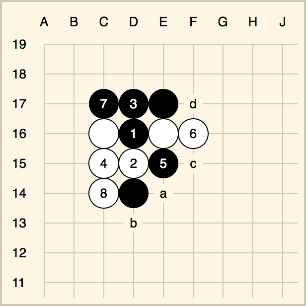

# Go-type

Go-type turns Go diagrams in [Sensei's Library Format][slf] into [SVG][svg]. In other words, it turns this:

    $$Bc A joseki variation
    $$  ------------------
    $$ | . . . . . . . . .
    $$ | . . . . . . . . .
    $$ | . . 7 3 X d . . .
    $$ | . . O 1 O 6 . . .
    $$ | . . 4 2 5 c . . .
    $$ | . . 8 X a . . . .
    $$ | . . . b . . . . .
    $$ | . . . . . . . . .
    $$ | . . . . . . . . .

...into this:

> 
> 
> A joseki variation

## Usage

### In the browser

1.  Include [D3][d3] and go-type ([download][releases]):
    ```html
    <link rel="stylesheet" href="go-type.css">

    <script src="http://d3js.org/d3.v3.min.js" charset="utf-8"></script>
    <script src="go-type.js"></script>
    ```

2.  Put Go diagrams on the page:
    ```html
    <div class="slf-board"><pre>
    $$Bc A joseki variation
    $$  ------------------
    $$ | . . . . . . . . .
    $$ | . . . . . . . . .
    $$ | . . 7 3 X d . . .
    $$ | . . O 1 O 6 . . .
    $$ | . . 4 2 5 c . . .
    $$ | . . 8 X a . . . .
    $$ | . . . b . . . . .
    $$ | . . . . . . . . .
    $$ | . . . . . . . . .
    </pre></div>

    <script>
    d3.selectAll('.slf-board').each(goType.rewrite);
    </script>
    ```

### In Node.js

1.  Add `go-type` as a dependency in your Node.js project with `npm install go-type --save`

2.  Use `goType.stream()` in a pipeline to transform Go diagrams into SVG. You can mix Go diagrams with other text -- diagrams become SVG while other text passes through.
    ```javascript
    var goType = require('go-type'),
            fs = require('fs');

    fs.createReadStream('./in.html')
      .pipe(goType.stream())
      .pipe(fs.createWriteStream('./out.html'));
    ```

3.  Include go-type CSS in the resulting HTML ([download][releases]):
    ```html
    <link rel="stylesheet" href="go-type.css">
    ```
    
[slf]: http://senseis.xmp.net/?HowDiagramsWork "How diagrams work at Sensei's Library"
[svg]: http://en.wikipedia.org/wiki/Scalable_Vector_Graphics
[d3]: http://d3js.org
[releases]: https://github.com/forrestjacobs/go-type/releases
